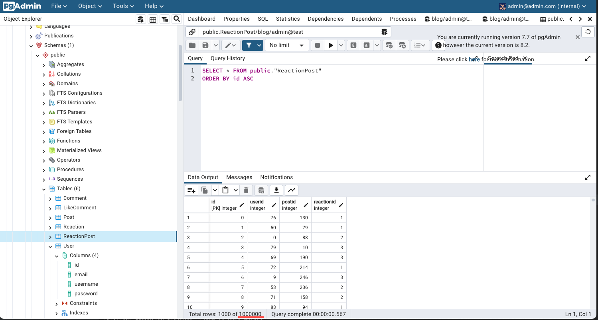
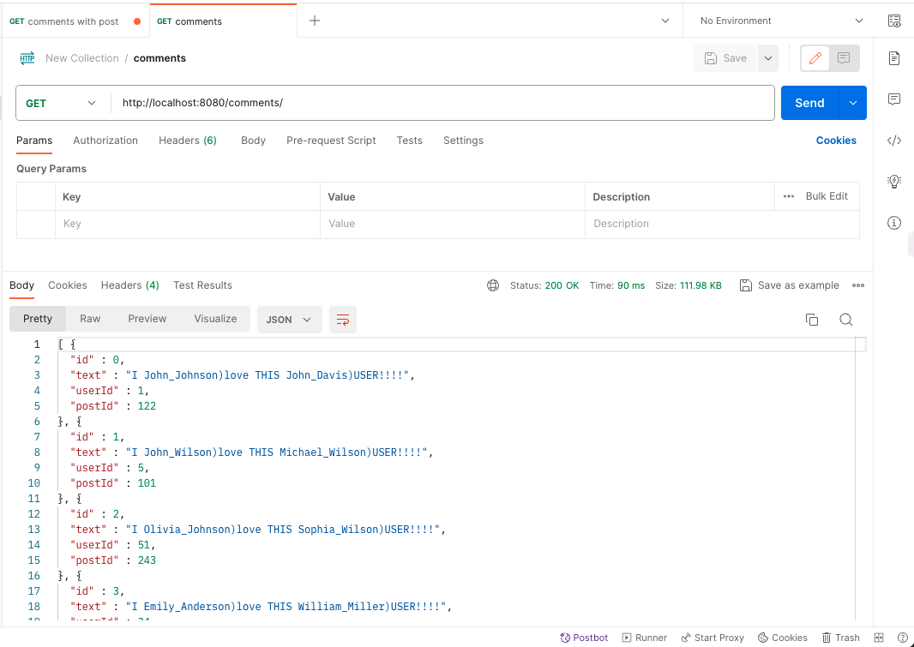
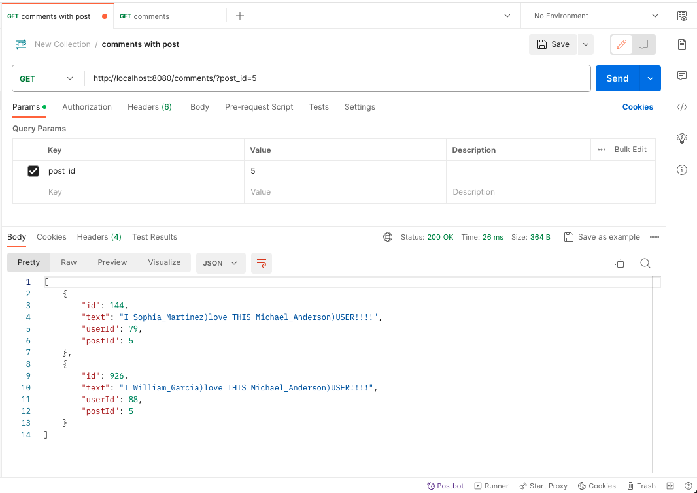

# Blog
## 1 Атта

### Название проекта
Проект, который я разработал, называется "Блог". Это приложение на Java, предназначенное для работы с репозиториями в памяти, хранящими информацию о пользователях, постах, комментариях, лайках и реакциях.

### Структура проекта
1. **Модели (models):**
   - **Entity:** Интерфейс, предоставляющий методы для получения и установки идентификатора (ID).
   - **Comment:** Модель комментария с полями: текст, идентификатор пользователя и идентификатор поста.
   - **LikeComment:** Модель лайка к комментарию с полями: идентификатор пользователя и идентификатор комментария.
   - **Post:** Модель поста с полями: заголовок, текст и идентификатор пользователя.
   - **Reaction:** Модель реакции с полями: смайл, описание и оценка.
   - **ReactionPost:** Модель реакции на пост с полями: идентификатор пользователя, идентификатор поста и идентификатор реакции.
   - **User:** Модель пользователя с полями: электронная почта, имя пользователя и пароль.

2. **Репозитории (repositories):**
   - **Repository:** Интерфейс для обобщенных операций репозитория.
   - **CommentRepo:** Расширение репозитория для работы с комментариями, включая получение комментариев по идентификатору поста.
   - **LikeCommentRepo:** Расширение репозитория для работы с лайками к комментариям.
   - **PostRepo:** Расширение репозитория для работы с постами, включая получение постов по идентификатору пользователя.
   - **ReactionPostRepo:** Расширение репозитория для работы с реакциями на пост, включая получение количества реакций по идентификатору поста.
   - **RepositoryLib:** Интерфейс, предоставляющий доступ к всем репозиториям.

3. **Репозитории в памяти (memory repositories):**
   - **RepositoryMemory:** Абстрактный класс, реализующий общую логику для репозиториев в памяти.
   - **CommentRepository:** Реализация репозитория для комментариев, включая проверку внешних ключей и каскадное удаление.
   - **LikeCommentRepository:** Реализация репозитория для лайков к комментариям.
   - **PostRepository:** Реализация репозитория для постов, включая проверку внешних ключей и каскадное удаление.
   - **ReactionPostRepository:** Реализация репозитория для реакций на пост, включая проверку внешних ключей и каскадное удаление.
   - **ReactionRepository:** Реализация репозитория для реакций.
   - **UserRepository:** Реализация репозитория для пользователей, включая проверку внешних ключей и каскадное удаление.
   - **MemoryRepositoryLib:** Реализация интерфейса `RepositoryLib`, предоставляющая доступ к репозиториям в памяти.

4. **JSON:**
   - **ListWrapper:** Обертка для списков моделей, используемая при сериализации и десериализации в JSON формате.
   - **Deserializer:** Класс для десериализации данных из файла JSON в репозитории в памяти.
   - **Serializer:** Класс для сериализации данных из репозиториев в памяти в файл JSON.

5. **Генератор (Generator):**
   - **Generator:** Класс для генерации случайных данных и добавления их в репозитории в памяти.

6. **Главный класс (Main):**
   - **Main:** Главный класс, в котором происходит инициализация репозиториев, генерация данных (по желанию пользователя) и вывод информации о пользователях и постах.

### Основные функции проекта
1. Создание, чтение и запись данных в файл JSON.
2. Работа с репозиториями в памяти для пользователей, постов, комментариев, лайков и реакций.
3. Генерация случайных данных для заполнения репозиториев.

### Взаимодействие с пользователем
Проект предоставляет консольный интерфейс, в котором пользователь может выбрать, хочет ли он сгенерировать данные и записать их в файл JSON, либо прочитать данные из файла JSON.

### Структура Gradle и Использование Аннотаций в Моделях

1. **Структура проекта с использованием Gradle:**
   - Проект организован с использованием системы сборки Gradle, что обеспечивает удобное управление зависимостями и сборкой проекта.
   - Весь проект разбит на модули, что улучшает структурирование кода и обеспечивает лучшую читаемость.
   - Использование Gradle позволяет легко добавлять и обновлять библиотеки, а также управлять версиями зависимостей.

2. **Модели с использованием аннотаций:**
   - В моделях (например, классах `User`, `Post`, `Comment`, и других) широко используются аннотации для различных целей.
   - **Lombok Аннотации:**
      - `@Getter`: Аннотация для автоматической генерации методов получения (геттеров) для полей класса, что сокращает объем кода.
      - `@NoArgsConstructor`: Аннотация, создающая конструктор без аргументов, что полезно для работы с библиотеками сериализации/десериализации данных.
      - `@AllArgsConstructor`: Аннотация, создающая конструктор, инициализирующий все поля класса, что упрощает создание экземпляров объектов.
   - **Jackson Аннотации:**
      - `@JsonTypeInfo`: Аннотация Jackson, используемая для указания информации о типе при сериализации в JSON формат, что полезно для десериализации данных.
      - `@Id`: Аннотация, обозначающая идентификатор для `JsonTypeInfo`, которая определяет тип объекта в JSON.
   - **Other Annotations:**
      - Возможно, используются и другие аннотации для поддержки различных функциональностей и библиотек в Java.

### Заключение
Этот проект представляет собой небольшое приложение, демонстрирующее работу с репозиториями в памяти, сериализацией и десериализацией данных в JSON. Код написан на Java с использованием различных библиотек и шаблонов проектирования.

## 2 Атта
Давайте разберем этот код, начиная с основных компонентов и шагов, которые я предпринял.

### 1. **Интерфейс `SQLConnector` и Класс `PostgreSQLConn`:**
- Я создал интерфейс `SQLConnector`, который описывает методы для выполнения SQL-запросов (`makeQuery`) и SQL-обновлений (`makeUpdate`).
- Класс `PostgreSQLConn` реализует этот интерфейс и предоставляет подключение к PostgreSQL базе данных.
- В классе реализован шаблон Singleton для обеспечения единственного экземпляра подключения.

### 2. **Абстрактный класс `SQLRepository` и его Реализации:**
- `SQLRepository` - это абстрактный класс, предоставляющий общие методы для работы с репозиторием (добавление, получение, обновление, удаление).
- Метод `getColumnQuery` формирует часть SQL-запроса для выборки колонок.
- Метод `add` добавляет новый объект в базу данных и обрабатывает сгенерированный идентификатор.

### 3. **Классы Репозиториев (`SQLCommentRepository`, `SQLLikeCommentRepository`, и т.д.):**
- Каждый класс репозитория предоставляет методы для работы с соответствующей сущностью (`Comment`, `LikeComment`, и т.д.).
- Метод `getWithFilters` позволяет выполнять запросы с дополнительными фильтрами.
- Методы `getNewT` и `getColumns` используются для создания нового объекта из `ResultSet` и формирования массива значений для SQL-запроса соответственно.
- В классах также реализован Singleton для обеспечения единственного экземпляра репозитория.

### 4. **Класс `SQLRepositoryLib`:**
- Этот класс предоставляет фабричные методы для получения экземпляров различных репозиториев.
- Реализует интерфейс `RepositoryLib`, который объединяет все репозитории.

### 5. **Класс `JSON_to_base`:**
- Пример использования кода для десериализации данных из JSON файла и сохранения их в базе данных.
- Создается экземпляр `RepositoryLib`, инициализируется `Deserializer`, который затем выполняет десериализацию из файла и сохраняет в базу данных.

### 6. **Дополнительно:**
- SQL-таблицы создаются с использованием `CREATE TABLE IF NOT EXISTS`.
- Реализованы методы для работы с реакциями на посты, комментарии, пользователями, а также лайками к комментариям.
- В коде предусмотрены обработка исключений и логирование ошибок.

В целом, код построен на принципах ООП, обеспечивает удобство масштабирования и поддержки, а также предоставляет гибкость при работе с базой данных и JSON-данными.
#### Миллион записей в базе

## 3 Атта
В предоставленном коде реализован веб-интерфейс приложения на языке Java с использованием сервлетов. Давайте разберем основные аспекты этой реализации.

1. **Абстрактный класс CRUDServlet<T extends Entity>:**
   - Этот класс является абстрактным сервлетом, предоставляющим базовую реализацию операций CRUD (Create, Read, Update, Delete) для сущностей типа `T`, которые должны быть наследниками класса `Entity`.
   - Сервлет предоставляет методы для обработки HTTP-запросов различных типов: GET, POST, PUT и DELETE.
   - Определены методы `getIdFromPath` для извлечения идентификатора из пути запроса и `getWithParams` для получения сущностей с дополнительными параметрами.
   - Реализованы обработчики для каждого типа запроса, включая чтение, добавление, обновление и удаление сущностей.

2. **Классы-наследники CRUDServlet:**
   - В коде представлены несколько классов-наследников, таких как `CommentServlet`, `LikeCommentServlet`, `PostServlet`, `ReactionPostServlet`, `ReactionServlet` и `UserServlet`. Каждый из них предоставляет реализацию метода `getWithParams` для работы с конкретными сущностями.

3. **Метод `main` в классе Main:**
   - В классе `Main` реализован метод `main`, который является точкой входа в приложение.
   - Создается экземпляр `Tomcat` для настройки веб-сервера на порту 8080.
   - Добавляется веб-контекст, в котором настраивается сканирование аннотаций и добавление ресурсов из JAR/папки, содержащей класс `Main`.
   - Запуск сервера Tomcat.

4. **Тестирование с Postman:**
   - Все запросы были протестированы с использованием Postman. В процессе тестирования проверялась корректность обработки различных типов запросов и соответствие ожидаемым результатам.

Общий результат — создано веб-приложение, использующее сервлеты для обработки запросов к базе данных и предоставляющее CRUD-операции для различных сущностей.